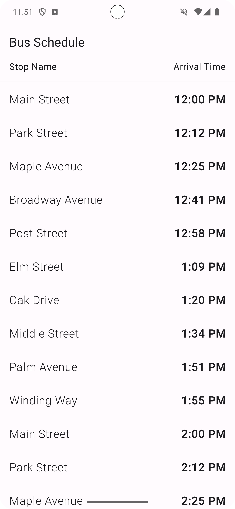
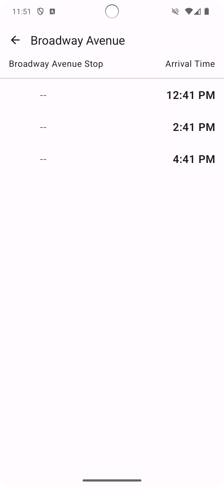

# Bus Schedule App

The Bus Schedule app displays a list of bus stops and arrival times. Tapping a bus stop on the first
screen will display a list of all arrival times for that particular stop.

The bus stops are stored in a Room database. Schedule items are represented by the `Schedule` class 
and queries on the data table are made by the `ScheduleDao` class. The app includes a view model to
access the `ScheduleDao` and format data to be display in a list.

It's developed using Jetpack Compose components like ```Column```, ```Button```, ```Text```, ```Image```, and ```Modifier```.

<p align="center">
  
  
</p>

# Getting Started
1. Install Android Studio, if you don't already have it.
2. Download the sample.
3. Import the sample into Android Studio.
4. Build and run the sample.